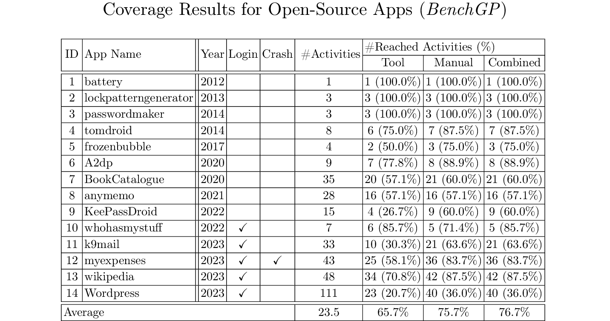
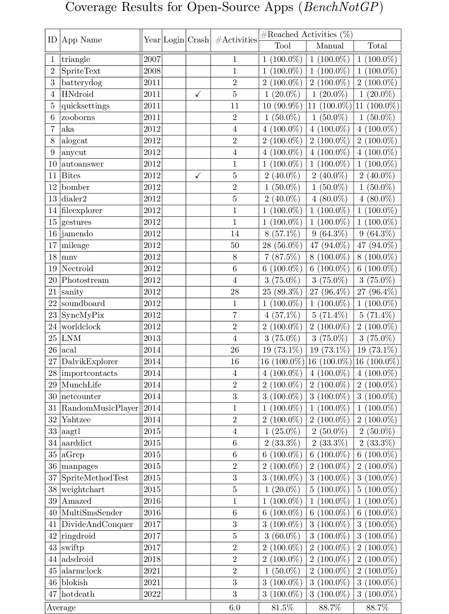

### Selected Google Play Applications
---
We select 42 top ranked free applications from the Google Play Store, sampled in January and May 2023, covering all app categories:

### Coverage Results

The detailed coverage results for APE and manual analysis are provided as an [Excel sheet](../assets/data/CoverageResults.xlsx). 
For each application under study, we mark which activities are reached by APE and which are reached manually.

We also provide plots of the coverage improvement over time achieved by manual analysts in this [zip file](../assets/data/plots.zip)

### App Analysis

The detailed breakdown of manually extracted reasons for unreachability is also provided as an [Excel sheet](../assets/data/AppAnalysis.xlsx). 

For each application under study, we grey out activities that are reached manually, and for each unreached activity, we mark the reasons leading to unreachability as described in the paper, i.e., Device (Software properties and Hardware properties), Server, Environment, External resources (Equipment and Information), Usage patterns, Alternate entry, Disabled (For app version and For all end-users), Error handling, No caller and Unknown.

---

### Selected Benchmark Applications

---
We also experiment on a subset applications from the [AndroTest dataset](http://www.cc.gatech.edu/∼orso/software/androtest). From 68 applications originally present in the dataset, we exclude 7 apps which crash on startup and for which we can not reliably identify source code.

We reconstitute the dataset by selecting the latest available version for each of the 61 applications as of July 2023.
We further divide it into two datasets depending on whether the applications are also available on the Google Play Store or not, namely BenchGP and BenchNotGP:

---

### Coverage Results

We report the average coverage achieved the by the tool and manual analysis on BenchGP and BenchNotGP:

