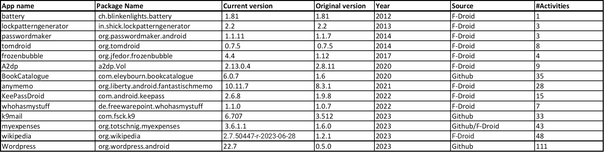

### Selected Google Play Applications

We select 42 top ranked free applications from the Google Play Store, sampled in 2023, covering all app categories:

---

### Selected Benchmark Applications

We also experiment on a subset applications from the [AndroTest dataset](http://www.cc.gatech.edu/∼orso/software/androtest). From 68 applications originally present in the dataset, we exclude 7 apps which crash on startup and for which we can not reliably identify source code.

We reconstitute the dataset by selecting the latest available version for each of the 61 applications as of July 2023.
We further divide it into two datasets depending on whether the applications are also available on the Google Play Store or not, namely BenchGP and BenchNotGP:

