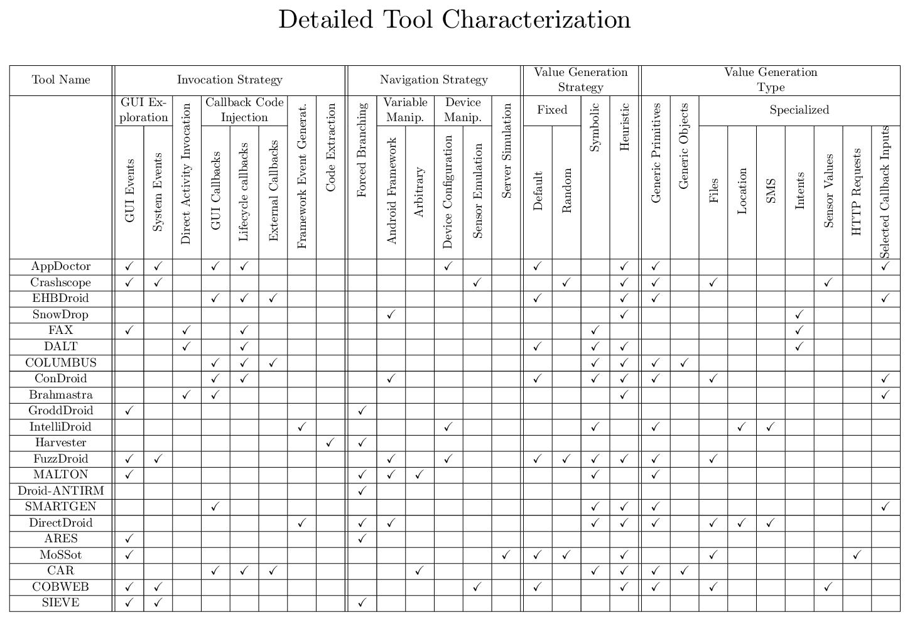

### Selected Papers

---

Starting from existing surveys on testing approaches for mobile software<cite>[1,2,3]</cite>, we selected all approaches that propose mechanisms for different forms of ecosystem manipulation, i.e., that modify the app or what it interacts with namely the framework, the device or external components.

We excluded approaches which require additional human input to guide the exploration, such as bug reports or pre-computed app models, and approaches only applicable to a specific goal, e.g., thread manipulation for data race detection, which would not map to generic app exploration. 
Next, we performed forward snowballing, to augment our list with papers published after the surveys' timeline, using the same inclusion/exclusion criteria. 
At the end of this process, we identified 22 relevant papers that propose beyond-GUI app exploration strategies.

[1] Kong, Pingfan, et al. "Automated testing of android apps: A systematic literature review." IEEE Transactions on Reliability, 2018.

[2] Luo, Chu, et al. "A survey of context simulation for testing mobile context-aware applications." ACM Computing Surveys (CSUR), 2020.

[3] Júnior, Misael C., et al. "Dynamic testing techniques of non-functional requirements in mobile apps: A systematic mapping study." ACM Computing Surveys (CSUR), 2022.

---

### Categorization of App Exploration Strategies

---

We characterize the app exploration approach of our 22 selected techniques along four dimensions: Invocation Strategy,  Navigation Strategy, Value Generation Strategy and Value Generation Type. For completeness, we also mark which of the selected papers perform GUI Exploration by sending GUI and/or System Events (in addition to their main exploration strategy).

<b>Invocation Strategy</b>: mechanisms tools employ to launch any given activity and trigger activation locations, notably:

<ul>
    <li><i>Direct Activity Invocation</i>: sending intents to directly jump start an activity through utilies like ADB. To trigger even non-exported activities, tools can modify the Manifest file to expose all activities.</li>
    <li><i>Callback Code Injection</i>: directly invoking callbacks through static or dynamic instrumentation. </li>
    <li><i>Framework Event Generation</i>: customizing the Android OS to inject events at the framework layer, i.e., invoke the same methods within the framework that are triggered by the hardware layer.</li>
    <li><i>Code Extraction</i>: generating a new application containing only one activity and none of the original application entry points, to target a given statement, e.g., startActivity.</li>
</ul>

<b>Navigation Strategy</b>: mechanisms tools employ to navigating past activation guards, given that the enclosing location is triggered. We identify four main implementation paradigms:
    
<ul>
    <li><i>Forced Branching</i>: modifying control flows of a program to steer execution towards a desired point of interest.</li>
    <li><i>Variable Manipulation</i>: manipulating code variables, to ensure execution takes the desired path, by intercepting Android framework APIs and/or arbitrary variables.</li>
    <li><i>Device Manipulation</i>: interacting with configurable and/or stateful aspects of devices without modifying code (e.g., time, location, sensor readings).</li>
    <li><i>Server Simulation</i>: monitoring network traffic to simulate server interactions accurately (in specific use cases).</li>
</ul>

<b>Value Generation Strategy </b> provides inputs necessary for invoking callbacks and activities, and for generating data to steer navigation. We identified three kinds of strategies:

<ul>
    <li><i>Fixed</i>: using random or default/manually-crafted values</li>
    <li><i>Heuristic</i>: integrating app- or domain-specific information (e.g, using natural language processing)</li>
    <li><i>Symbolic</i>: using a constraint solver to generate semantically meaningful values</li>
</ul>

<b> Value Generation Type</b> corresponds to the different types of data that can be generated for a given strategy, notably <i>Generic Primitives</i>, <i>Generic Objects</i> and <i>Specialized</i>.

---

### Additional Info

---

We provide additional tool-specific information, notably availability, targeting strategy, invasiveness and date published, in an [Excel sheet](../assets/data/ToolExtraInfo.xlsx).
